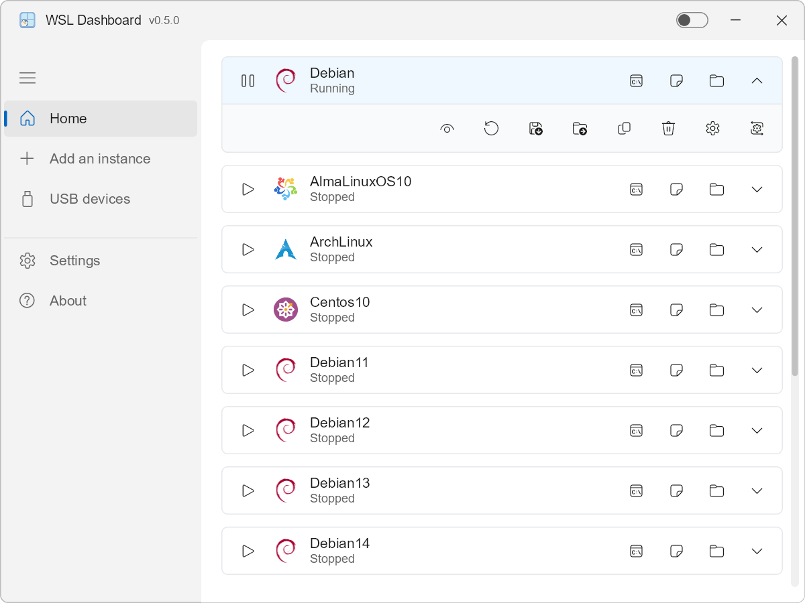
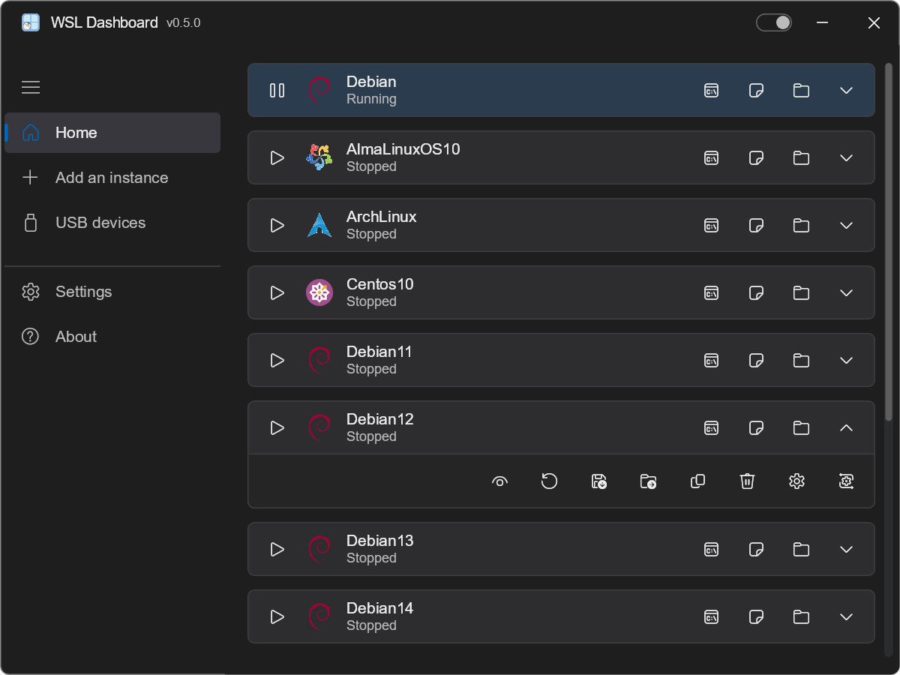
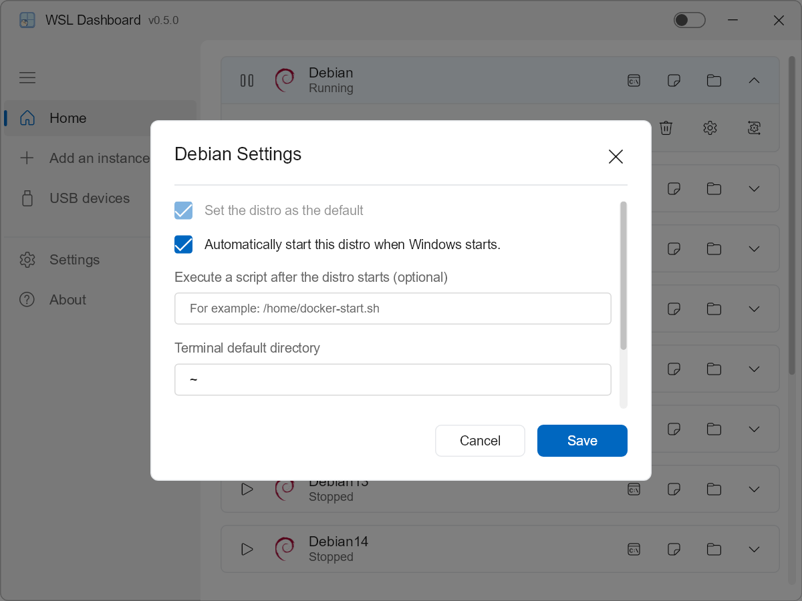
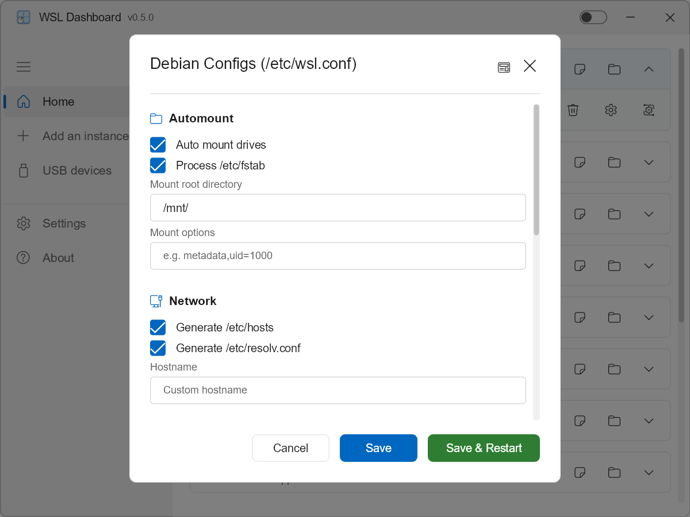
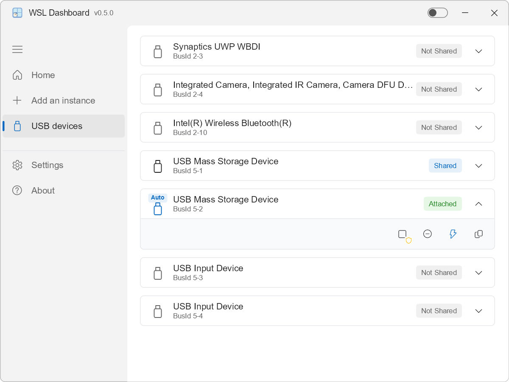
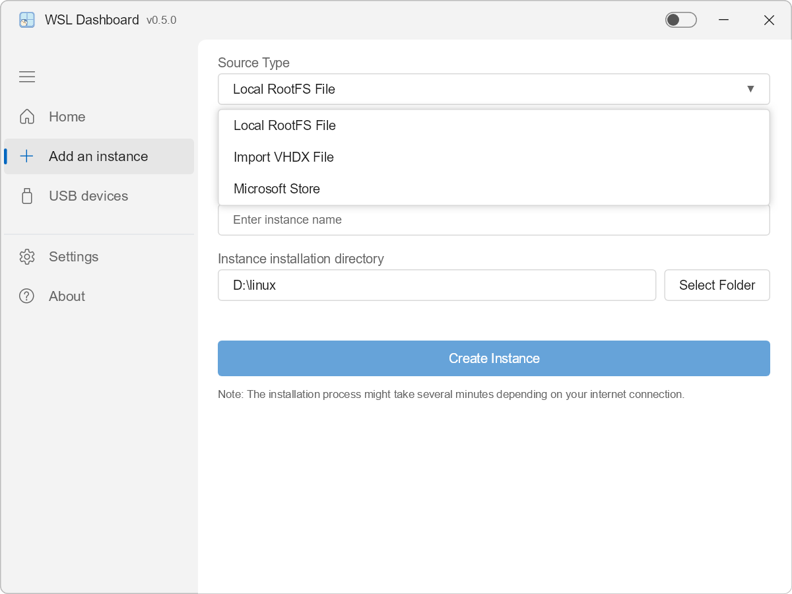
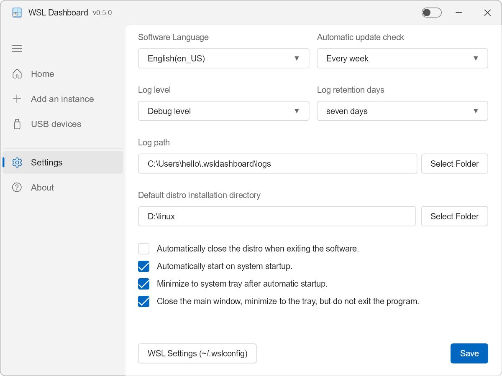
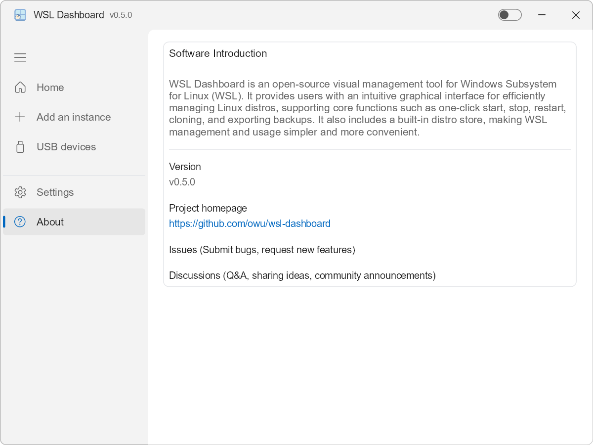
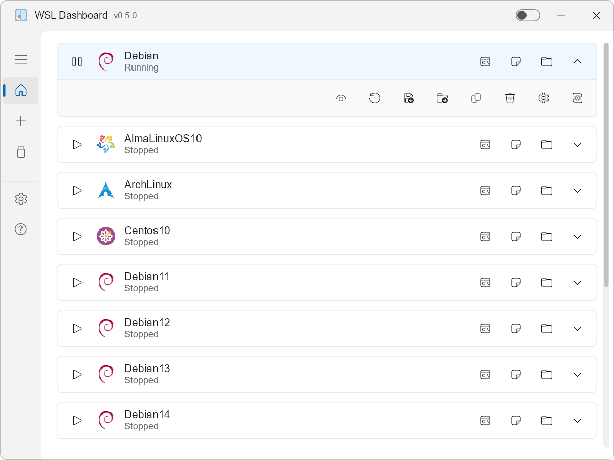

# WSL Dashboard

<p align="center">
  
</p>

Un tableau de bord moderne, performant et léger pour la gestion des instances WSL (Windows Subsystem for Linux). Conçu avec Rust et Slint pour une expérience native haut de gamme.

---

<p align="left">
  <a href="https://www.rust-lang.org"></a>
  <a href="https://slint.dev"></a>
  <a href="https://tokio.rs"></a>
  <a href="https://github.com/microsoft/windows-rs"></a>
  <a href="../LICENSE"></a>
</p>

I18N :  [English](../README.md) | [简体中文](./README_zh_CN.md) | [繁體中文](./README_zh_TW.md) | [हिन्दी](./README_hi.md) | [Español](./README_es.md) | Français | [العربية](./README_ar.md) | [বাংলা](./README_bn.md) | [Português](./README_pt.md) | [Русский](./README_ru.md) | [اردو](./README_ur.md) | [Bahasa Indonesia](./README_id.md) | [Deutsch](./README_de.md) | [日本語](./README_ja.md) | [Türkçe](./README_tr.md) | [한국어](./README_ko.md) | [Italiano](./README_it.md) | [Nederlands](./README_nl.md) | [Svenska](./README_sv.md) | [Čeština](./README_cs.md) | [Ελληνικά](./README_el.md) | [Magyar](./README_hu.md) | [עברית](./README_he.md) | [Norsk](./README_no.md) | [Dansk](./README_da.md) | [Suomi](./README_fi.md) | [Slovenčina](./README_sk.md) | [Slovenščina](./README_sl.md) | [Íslenska](./README_is.md)

---

## 📑 Table des Matières
- [🌍 Langues Supportées](#-langues-supportées)
- [🚀 Fonctionnalités Clés & Utilisation](#-fonctionnalités-clés--utilisation)
- [⚙️ Configuration & Logs](#️-configuration--logs)
- [🖼️ Captures d'écran](#️-captures-décran)
- [🎬 Démonstration](#-démonstration)
- [💻 Configuration Requise](#-configuration-requise)
- [📦 Guide d'Installation](#-guide-dinstallation)
- [🛠️ Stack Technique & Performance](#️-stack-technique--performance)
- [📄 Licence](#-licence)

---

## 🌍 Langues Supportées

Anglais, Chinois (Simplifié), Chinois (Traditionnel), Hindi, Espagnol, Français, Arabe, Bengali, Portugais, Russe, Ourdou, Indonésien, Allemand, Japonais, Turc, Coréen, Italien, Néerlandais, Suédois, Tchèque, Grec, Hongrois, Hébreu, Norvégien, Danois, Finnois, Slovaque, Slovène, Islandais

<p align="left">
  
  
  
  
  
  
  
  
  
  
  
  
  
  
  
  
  
  
  
  
  
  
  
  
  
  
  
  
  
</p>


## 🚀 Fonctionnalités Clés & Utilisation

- **Interface Native Moderne** : GUI intuitive, support des modes clair/sombre, animations fluides et rendu haute performance via **Skia**.
- **Intégration Systray** : Support complet de la réduction en zone de notification (~10 Mo de RAM), double-clic pour basculer et menu contextuel fonctionnel.
- **Démarrage Intelligent** : Configurer le dashboard pour démarrer avec Windows, réduit dans le tray (mode silencieux avec `/silent`) et arrêt automatique des distributions en quittant.
- **Contrôle Complet des Instances** : Démarrer, arrêter, terminer et désenregistrer en un clic. Surveillance d'état en temps réel, détails sur l'utilisation disque et l'emplacement des fichiers.
- **Gestion des Distributions** : Définir par défaut, migration (déplacer le VHDX vers d'autres disques), export et clonage vers `.tar` ou `.tar.gz`.
- **Intégration Rapide** : Lancement instantané du Terminal, VS Code ou de l'Explorateur avec répertoires de travail personnalisés et hooks de scripts de démarrage.
- **Installation Intelligente** : Installer depuis le Microsoft Store, GitHub ou des fichiers locaux (RootFS/VHDX). Assistant de téléchargement RootFS intégré.
- **Sécurité Globale** : Verrous mutex pour des opérations concurrentes sécurisées et nettoyage automatique Appx lors de la suppression.
- **Usage Mémoire Ultra-bas** : Hautement optimisé. Le démarrage silencieux (tray) utilise seulement **~10 Mo** de RAM. L'usage en mode fenêtre varie selon la complexité des polices : **~18 Mo** pour les langues standards et **~38 Mo** pour les langues à grands jeux de caractères (Chinois, Japonais, Coréen).


## ⚙️ Configuration & Logs

Toute la configuration est gérée via la vue Paramètres :

- Choisir le répertoire d'installation par défaut pour les nouvelles instances WSL.
- Configurer le répertoire des logs et le niveau de log (Error / Warn / Info / Debug / Trace).
- Choisir la langue de l'interface ou suivre la langue du système.
- Basculer le mode sombre, et l'arrêt automatique de WSL après opération.
- Configurer la fréquence des mises à jour (quotidienne, hebdomadaire, bimensuelle, mensuelle).
- Activer le démarrage automatique au boot (avec réparation auto du chemin).
- Régler l'app pour se réduire en tray au démarrage.
- Configurer le bouton fermer pour réduire en tray au lieu de quitter.

Les fichiers de log sont écrits dans le répertoire configuré et peuvent être joints lors du signalement de problèmes.


## 🖼️ Captures d'écran

### Accueil (Mode Sombre & Clair)
<p align="center">
  
  
</p>

<p align="center">
  
  
</p>

### USB
<p align="center">
  
</p>

### Ajouter une Instance & Paramètres
<p align="center">
  
  
</p>

### À propos & menu réduit
<p align="center">
  
  
</p>

## 🎬 Démonstration

Voici une démonstration de WSL Dashboard en action :


## 💻 Configuration Requise

- Windows 10 ou Windows 11 avec WSL activé (WSL 2 recommandé).
- Au moins une distribution WSL installée, ou l'autorisation d'en installer de nouvelles.
- Processeur 64 bits ; 4 Go de RAM ou plus recommandés pour une utilisation fluide.

## 📦 Guide d'Installation

### Option 1 : Télécharger l'exécutable précompilé

La méthode la plus simple est d'utiliser la version déjà compilée :

1. Allez sur la page des [GitHub Releases](https://github.com/owu/wsl-dashboard/releases).
2. Téléchargez le dernier exécutable `wsldashboard` pour Windows.
3. Extrayez (si nécessaire) et lancez `wsldashboard.exe`.

Aucun installateur n'est requis ; l'application est un binaire portable unique.

### Option 2 : Compiler à partir des sources

Assurez-vous d'avoir installé la chaîne d'outils Rust (Rust 1.92+ ou plus récent).

1. Clonez le dépôt :

   ```powershell
   git clone https://github.com/owu/wsl-dashboard.git
   cd wsl-dashboard
   ```

2. Compilez et lancez :

   - Pour le développement :

     ```powershell
     cargo run
     ```
   - Créer un build de production optimisé via le script :

     > Le script de build nécessite la chaîne d'outils `x86_64-pc-windows-msvc`.

     ```powershell
     .\build\scripts\build.ps1
     ```


## 🛠️ Stack Technique & Performance

- **Cœur** : Implémenté en Rust pour la sécurité mémoire et des abstractions à coût nul.
- **Framework UI** : Slint avec backend de rendu **Skia** haute performance.
- **Async Runtime** : Tokio pour des commandes système et des E/S non bloquantes.
- **Points Forts Performance** :
  - **Réactivité** : Démarrage quasi instantané et surveillance d'état WSL en temps réel.
  - **Efficacité** : Usage ressource ultra-bas (voir [Fonctionnalités Clés](#-fonctionnalités-clés--utilisation)).
  - **Portabilité** : Le build optimisé produit un exécutable compact unique.


## 📄 Licence

Ce projet est sous licence GPL-3.0 – voir le fichier [LICENSE](../LICENSE) pour plus de détails.

---

Built with ❤️ for the WSL Community.
